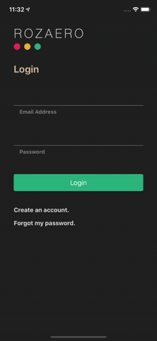
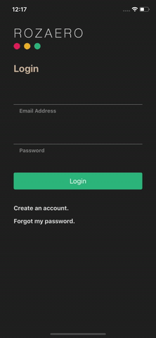

# Rozaero UI

Rozaero is a cooperative playlist generator that allows guests to influence the composition and order of an event's playlist.

## Problem Statement

Event organizers have to construct playlists to fulfill their event's music needs. Traditionally, a small group of organizers assemble the playlist. They fill it with their favorite songs and, unfortunately, their potentially unpopular taste in music.

This system of playlist management presents a couple of problems. Most obviously, it leaves open the risk that guests simply dislike the playlist. More importantly, the system offers guests no way to voice their concerns and forces them to leave the event feeling disappointed. This lack of satisfaction among guests can translate into lower interest and revenues in the future.

Luckily, Rozaero's cooperative playlist format introduces an innovative solution to this problem.

## Demo

The following GIFs display some functionalities of the Rozaero mobile application.

### Login and Playlist Influencing

Here, we can see the user "John Smith" logging into the Rozaero system, accessing the "Winter Formal 2021" event, and voting for a song. It is important to note that the user's two votes in support of "Youngblood" by 5 Seconds of Summer push that track to the top of the event's playlist queue. This brief example demonstrates how Rozaero empowers the traditionally powerless guest and makes clear the advantage of using Rozaero for playlist management over conventional methods.

Although it is not readily apparent, readers should note that the demo showcases Rozaero's ability to restrict playlist access and voting to users in host-defined regions. The XCode simulator used to demo the application had its location set to a point within the access region of Nadith Dharmasena's "Winter Formal 2021" event, which explains why John Smith is able to view the event.

### Registration and Email Validation

Here, we can see the user "James Johnson" creating a new Rozaero account. Once James completes his registration, Rozaero sends him an email containing a confirmation code. James uses this confirmation code to validate his email address and activate his account. Finally, he logs in to his newly created account and sees that his current location falls within John Smith's "Fall Bash 2020" access region.

## Notes

The API used to facilitate this mobile application's operations is located at [Rozaero API](https://github.com/nadithdharmasena/rozaero-api).
